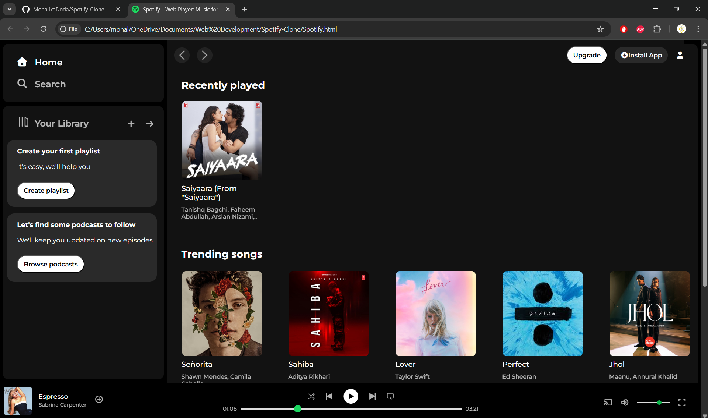
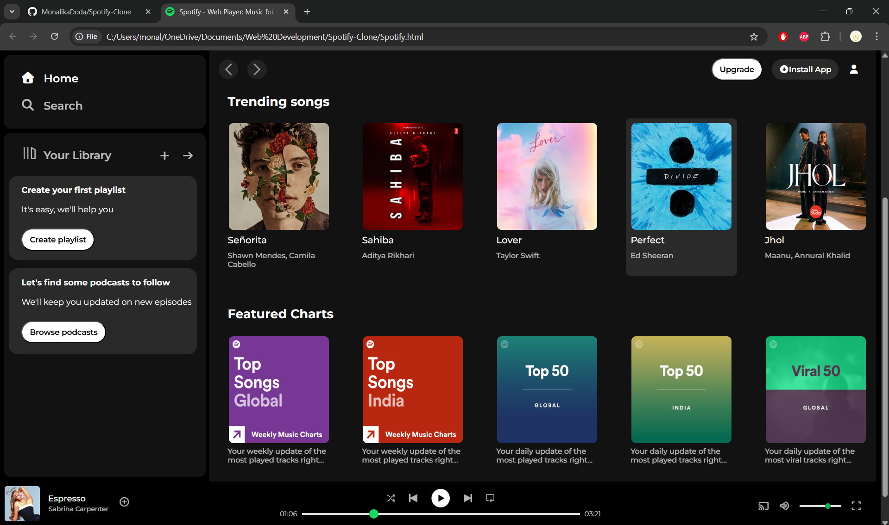

# Spotify-Clone

This is a simple **Spotify-inspired music player UI** built using **HTML and CSS only**.  
It recreates the layout and design of the original Spotify web interface.

## Features
- Static navigation sidebar
- Playlist and content layout inspired by Spotify
- Music player controls (UI only – no functionality)

## Screenshot
Here are screenshots of my project:

## Technologies Used
- HTML5
- CSS3
- Google Fonts for typography
- Font Awesome and Google Icons for icons

## Author
**Monalika Doda**
